# Background

I'd had cluster-template setup before on a single node talos VM and had a hard drive die... So, I'm doing it again.  It's been about 7 months since I did this before and the project is a bit different, so let's see how it goes.

For my starting point I am running windows 11 with vscode, hyper-v, docker desktop for windows, and wsl2 installed, typical consumer cable modem and an old router.  Despite being just a lowly windows user I am comfortable enough with linux and kubernetes, but it's not exactly my day job.

Why?  It's something to fiddle with... My goal is to host *www.me.com* and *www.mykid.com* all from the comfort of a vm running on windows while I play games on steam.  This seems perfectly reasonable and not at all overkill.

I have these existing domains on cloudflare that i'm going to use.  To start configuring my cluster I'm going to start with *me.net*, which I also own.  I have removed all dns entries, api keys, and tunnels from cloudflare.

I use a different order of operations than cluster-template, so I'll just call them steps and move on...

# Step 1: Git setup

- go to the [cluster-template](https://github.com/onedr0p/cluster-template)
- slap the green 'use the template' button
- create new private github repo: *github.com/me/cluster*
- clone *github.com/me/cluster* locally

# Step 2: Devcontainer install

- open cloned repo dir in vscode
- dev containers: reopen in container
- choose Kubernetes local configuration container template, no other devcontainers extensions
- vscode relaunches now in the dev container
- install vscode extensions when prompted

# Step 3: Devcontainer setup

### trust yourself

```bash
git config --global --add safe.directory /workspaces/cluster
```

### install updates and install nmap and dnsutils (for dig):

```bash
sudo apt-get update && sudo apt-get upgrade

sudo apt install nmap

sudo apt install dnsutils
```

### install mise:

```bash
sudo apt update -y && sudo apt install -y gpg sudo wget curl

sudo install -dm 755 /etc/apt/keyrings

wget -qO - https://mise.jdx.dev/gpg-key.pub | gpg --dearmor | sudo tee /etc/apt/keyrings/mise-archive-keyring.gpg 1> /dev/null

echo "deb [signed-by=/etc/apt/keyrings/mise-archive-keyring.gpg arch=amd64] https://mise.jdx.dev/deb stable main" | sudo tee /etc/apt/sources.list.d/mise.list

sudo apt update

sudo apt install -y mise

echo 'eval "$(/usr/bin/mise activate bash)"' >> ~/.bashrc
# on above like I changed the path from the mise docs from ~/.local/bin/mise to /usr/bin/mise as that's where which mise tells me it is ¯\_(ツ)_/¯

source ~/.bashrc
```

### install required tools via mise:

```bash
mise trust
pip install pipx
mise install
```

# Step 4: Cloudflare setup

- Add api key

---

Screenshot from [API Tokens - Cloudflare](https://dash.cloudflare.com/profile/api-tokens):
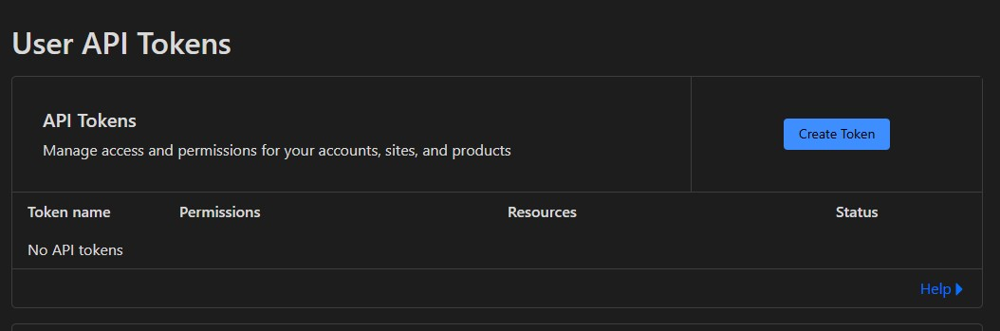

- I did not follow the cluster-template directions here which suggest using the Edit zone DNS template

---

Screenshot from [API Tokens - Cloudflare](https://dash.cloudflare.com/profile/api-tokens):
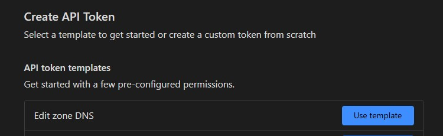

if you do this one you can't name it or somesuch...

- Instead used custom template

---

Screenshot from [API Tokens - Cloudflare](https://dash.cloudflare.com/profile/api-tokens):

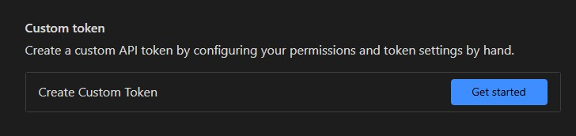

- Following values

---

Screenshot from [API Tokens - Cloudflare](https://dash.cloudflare.com/profile/api-tokens):

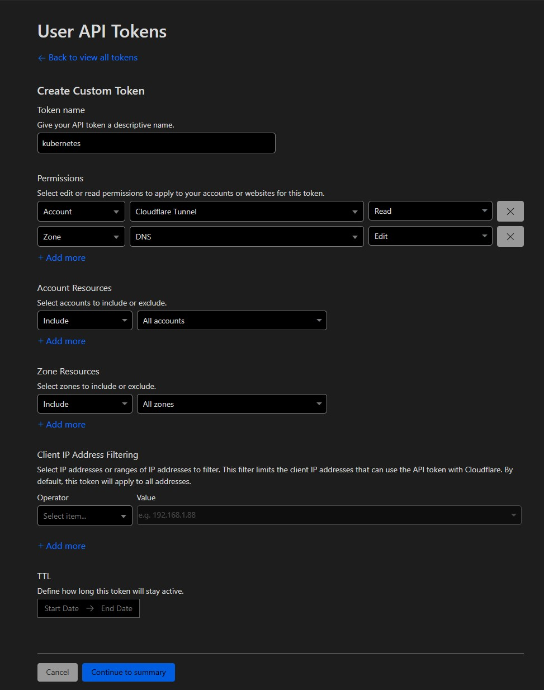

- Create token and **copy the token value somewhere handy**

---

Screenshot from [API Tokens - Cloudflare](https://dash.cloudflare.com/profile/api-tokens):

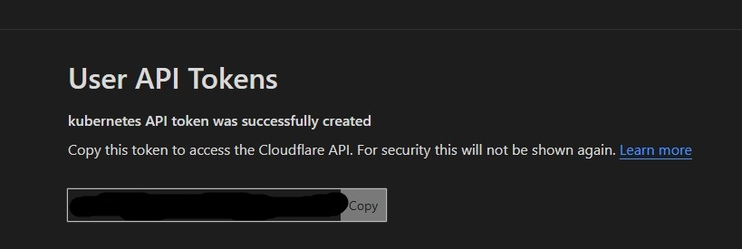

- Verify I see my token in cloudflare

---

Screenshot from [API Tokens - Cloudflare](https://dash.cloudflare.com/profile/api-tokens):

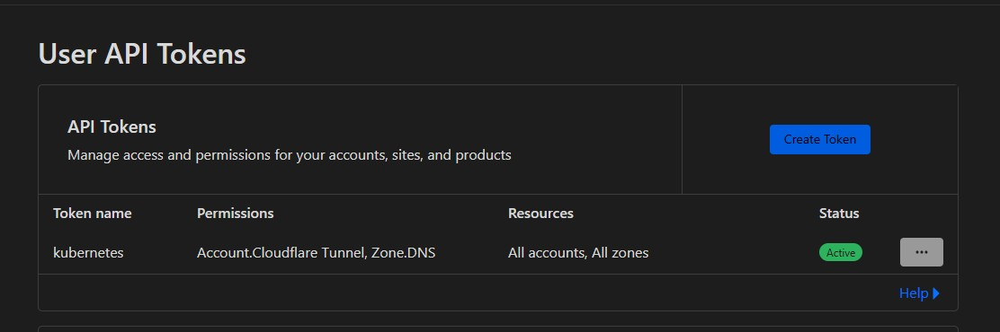

- Authorize cloudflared

```bash
cloudflared tunnel login
```

- Click the link in the shell, sign in, select the domain you want, in my case it's me.net, hit the authorize button, close tab when it says it's ok

- Create tunnel (this step will output a cloudflare-tunnel.json)

```bash
cloudflared tunnel create --credentials-file cloudflare-tunnel.json kubernetes
```

- Verify tunnel was created, I get there through cloudflare.com's search

---

Screenshot from [Cloudflare Dashboard](https://dash.cloudflare.com/):

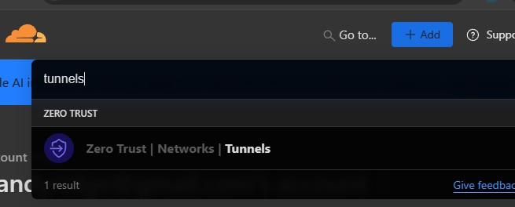

- It should be there and listed as inactive

---

Screenshot from [Cloudflare Dashboard](https://dash.cloudflare.com/):

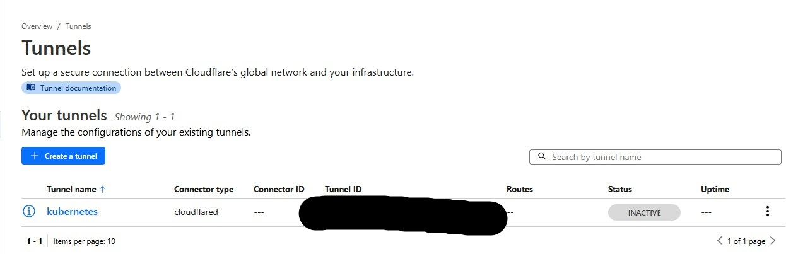

# Step 5: Talos ISO download

- This is the talos ISO I endeded up with: [Talos ISO](https://factory.talos.dev/?arch=amd64&cmdline-set=true&extensions=-&platform=metal&target=metal&version=1.9.4)

# Step 6: VM setup

- Create a new virtual machine in Hyper-V

---

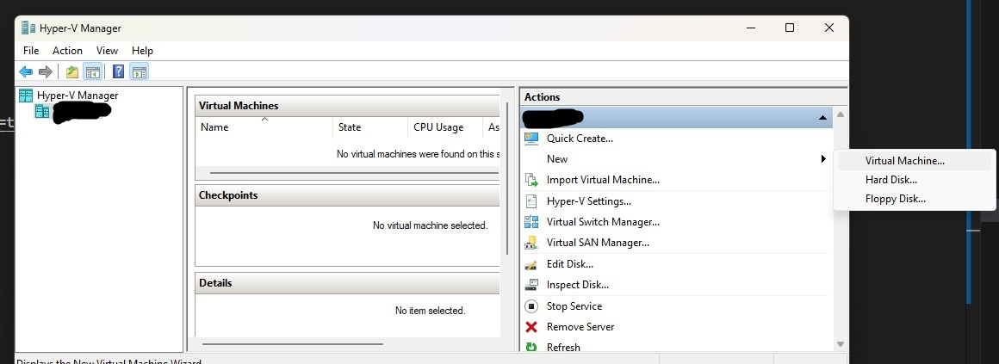


- Named the VM Talos

---

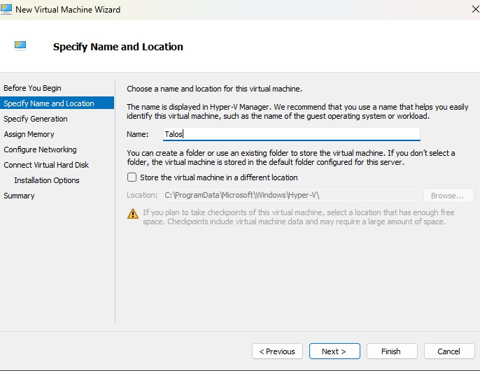

- Select Gen-2

---

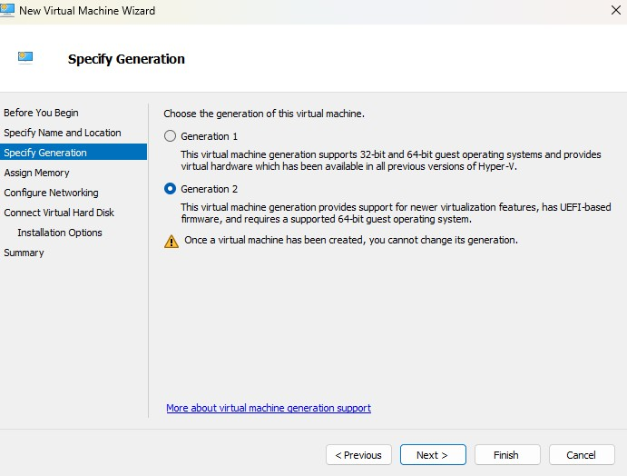

- Memory settings, 4GB + dynamic

---

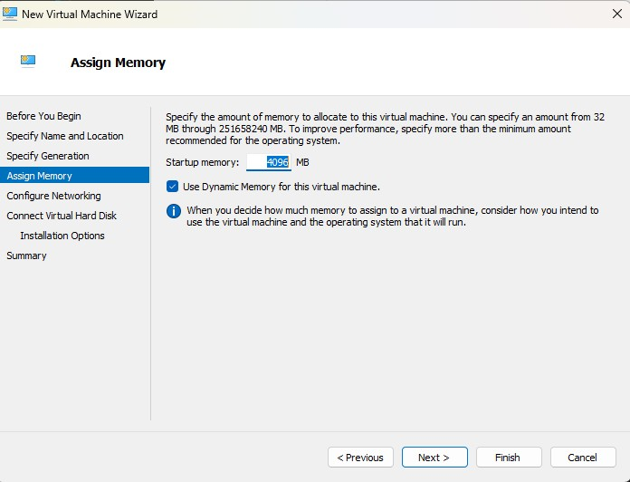

- Network settings, I use my pre-existing external switch

---

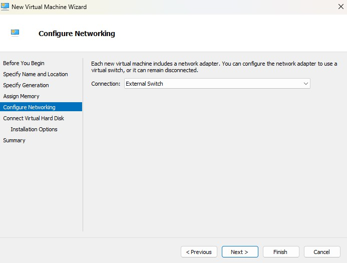

- Disk settings, I used the defaults

---

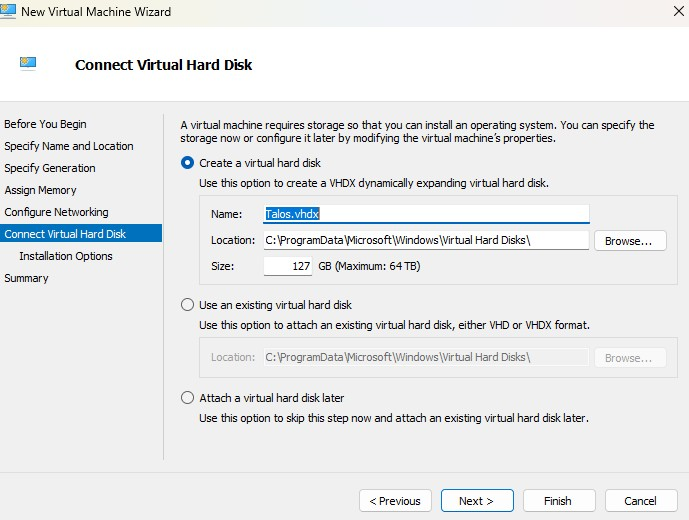

- Mount Talos ISO

---

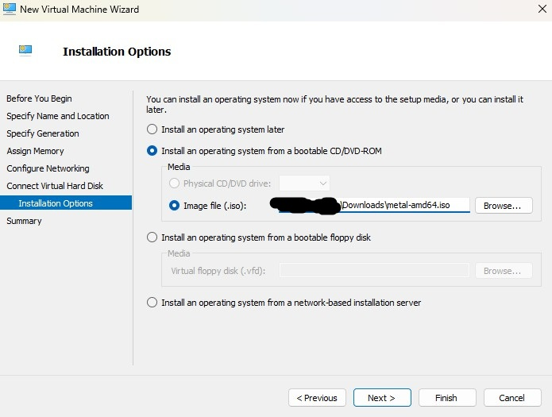

- Hit finish to make the Talos VM

- In the VM's settings disable secure boot

---

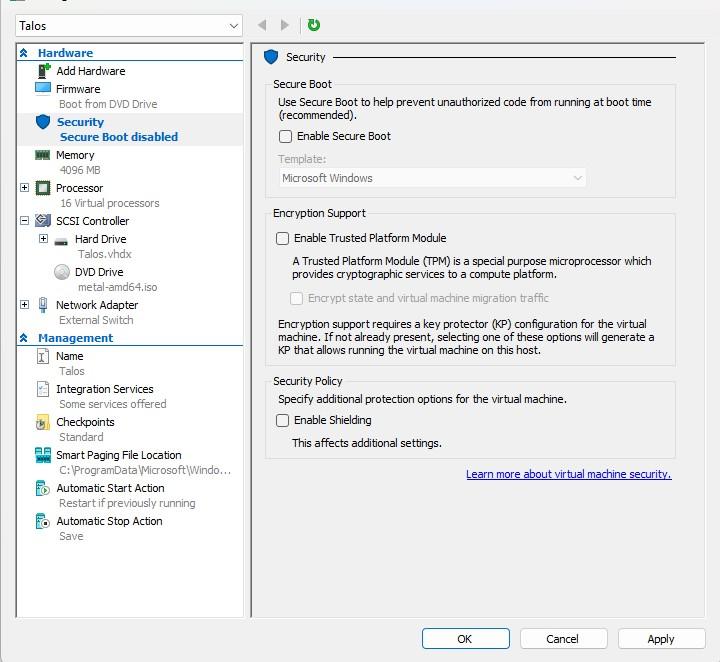

- In the VM's settings, I cut down on the number of cores allocated

---

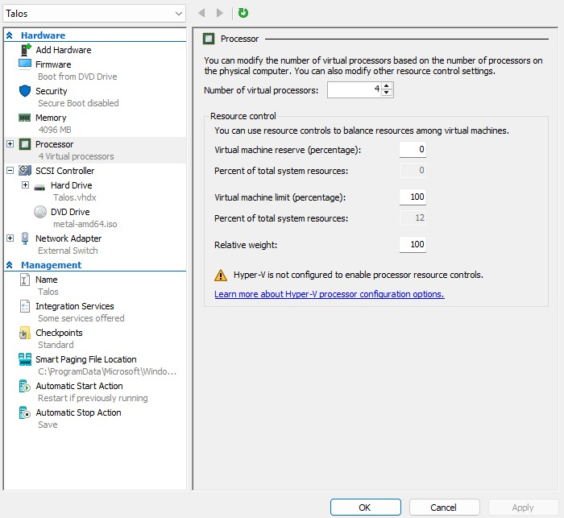

# Step 7: Start VM

- Just start the VM
- Connect to the VM

I note talos reports it's running on 192.168.0.167, which is my expected network 192.168.0.0/24, it correctly lists that it uses my gateway and dns that I expect from the virtual external switch.

# Step 8: Cluster configuration

- Generate cluster config files

```bash
task init
```

- Fill out cluster.yaml

For cluster.yaml I changed these lines, I picked a block of IP's that should be available, we'll go with the roaring 40's:

```yaml
node_cidr: "192.168.0.0/24"
cluster_api_addr: "192.168.0.40"
cluster_dns_gateway_addr: "192.168.0.41"
cluster_ingress_addr: "192.168.0.42"
repository_name: "me/cluster" # remember, I mentioned this way back in step 1
cloudflare_domain: "me.net" # remember, I mentioned this before we got started
cloudflare_token: "abunchofstuffgoeshere" # remember, we saved this somewhere handy way back in step 4
cloudflare_ingress_addr: "192.168.0.43"
```

- Fill out nodes.yaml


```yaml
---
nodes:
  - name: "talos01"
    address: "192.168.0.167" # as noted from step 7
    controller: true
    disk: "" # I can't find a value that works for this so I leave it blank
    mac_addr: "DE:AD:BE:EF:OH:MG"  # get the ether mac address from: talosctl get links -n 192.168.0.167 --insecure (i do this from my host machine as i have talosctl handy)
    schematic_id: "376567988ad370138ad8b2698212367b8edcb69b5fd68c80be1f2ec7d603b4ba" # from my talos iso link in step 5
    mtu: 1500
    secureboot: false
    encrypt_disk: false
```

- Write cluster config

```bash
task configure
```

# Step 9: Bootstrap Talos

- Install talos

```bash
task bootstrap:talos
```

Things will happen, you should see the Talos VM go into Installing state, you'll see some connection attempts refused in your shell, it's fine, just hang out.  The VM will reboot.  The VM should boot from iso again and mention to remove the disk and reboot

- Stop the vm

- Unmount the ISO

---

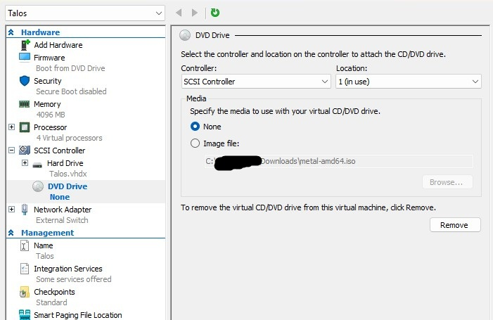

- I also change the boot order

---

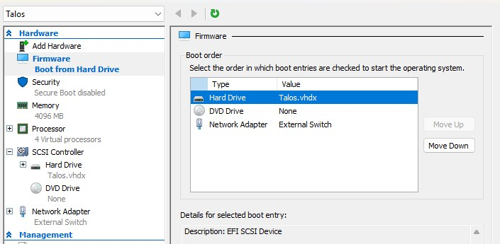

- Start the VM and your shell should complete and return control

# Step 10: Talos setup

```bash
task bootstrap:apps
```

You should see activity in your shell after a bit... Or you can kind of follow along in another terminal with:

```bash
kubectl get pods --all-namespaces --watch
```

Eventually you should get a congrats msg:

"2025-03-12T21:13:24Z INFO Congrats! The cluster is bootstrapped and Flux is syncing the Git repository "

```bash
cilium status
```

It should say it's ok

At this point though, we still don't have our network namespace running, so we carry on!

# Step 12: Flux

- Let's add our deploy key to our repo settings, in my case: [https://github.com/me/cluster/settings/keys](https://github.com/me/cluster/settings/keys)

---

Screenshot from [https://github.com/me/cluster/settings/keys](https://dash.cloudflare.com/):

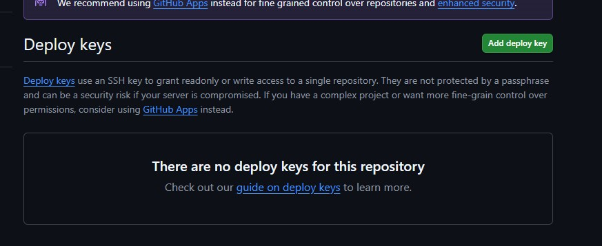

- Slap that green Add deploy key button

- Give it a name and paste in the content of `github-deploy.key.pub` and I gave it write access:

---

Screenshot from [https://github.com/me/cluster/settings/keys](https://dash.cloudflare.com/):

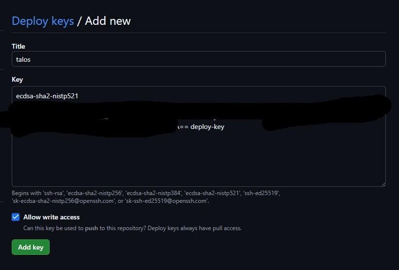

- Give it a name and paste in the content of `github-deploy.key.pub` and I gave it write access:

Screenshot from [https://github.com/me/cluster/settings/keys](https://dash.cloudflare.com/):

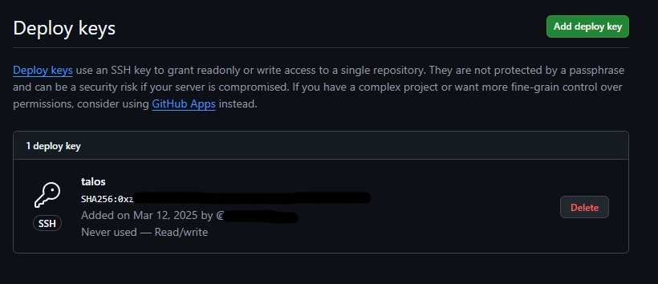


```bash
flux check
flux get sources git flux-system
```

At this point I'm left with an authentication failure:

flux get sources git flux-system
NAME            REVISION        SUSPENDED       READY   MESSAGE
flux-system                     False           False   failed to checkout and determine revision: unable to list remote for 'https://github.com/me/cluster.git': authentication required: Repository not found.

We will prevail!
