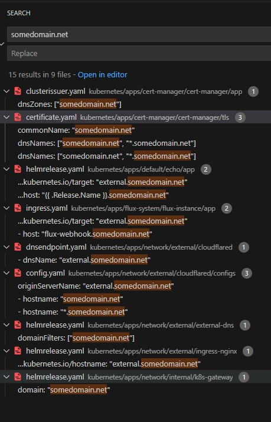
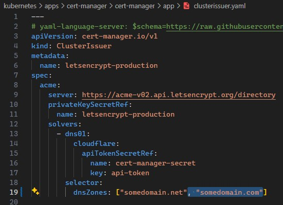
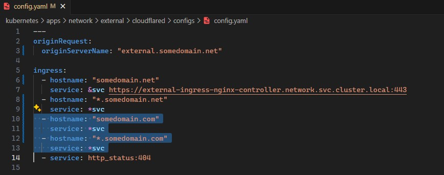
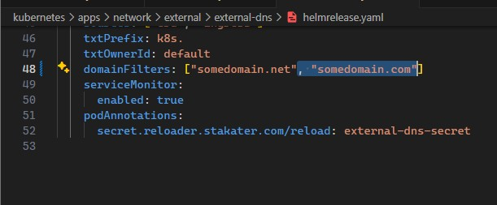

[Last time](../finish-up/finish-up.md) we finished setting up our home lab cluster using [cluster-template](https://github.com/onedr0p/cluster-template) to get kubernetes installed on [talos linux](https://www.talos.dev/) on a virtual machine.  We haven't done anything to modify it what cluster-template has provided so far.

If you recall we have our cluster running on *somedomain.net* with public hosts of:

- *echo.somedomain.net*
- *external.somedomain.net*
- *flux-webhook.somedomain.net*

While our *.net* domain is awesome and is super-appropriate for our *cluster*, when I'm out on the internet all the cool kids have *.com* domains!  We have to get with the times before the bubble bursts!  Today, we'll work on adding a totally different domain to our cluster -- *somedomain.com* and we'll expose it for the world to see.  I double checked and I see *somedomain.com* listed as a domain in my cloudflare account and it currently has no DNS entries set.

# Identity what we need to change

When we finished up our cluster one of the things that we did was to remove the secret SECRET_DOMAIN that contained the value of *somedomain.net* and just use the value.  Let's search our cluster's repo for *somedomain.net* to try to get an idea of what we'll need to change to get a new domain working.  For me this search returns 15 results in 9 files.

---



# Certificates for new domain

There's a couple of search hits related to [cert-manager](https://github.com/cert-manager/cert-manager) (which is setup in our cluster and configured to use [let's encrypt](https://letsencrypt.org/)). We will be needing a cert for our domain sooner or later, so let's add our *.com* to these files:

- `kubernetes/apps/cert-manager/cert-manager/app/clusterissuer.yaml` (file 1) 

---



Here we've added *somedomain.com* to our dnsZones which allows cert manager/let's encrypt to issue certs for our new domain.

- `kubernetes/apps/cert-manager/cert-manager/tls/certificate.yaml` (file 2)

---


Here we've duplicated the certificate for our *somedomain.net* certificate and replaced `net` with `com`.  There are other ways to do this, you could put the certs in separate yaml files and make sure they're included properly, etc.

Who said certificates were hard?

# Ignore Echo and Flux

Returning to our search from before:

- `kubernetes/apps/default/echo/app/helmrelease.yaml` (file 3)  which has to do with the example echo endpoint on our existing cluster domain *echo.somedomain.net* we're not interested in it right now.  

- `kubernetes/apps/flux-system/flux-instance/app/ingress.yaml` (file 4) which deals with our existing *flux-webhook.somedomain.net*, we'll leave it alone.

# Cloudflared

- `kubernetes/apps/network/external/cloudflared/dnsendpoint.yaml` (file 5) I don't believe should need to be changed, this is our dns entry for our cloudflare tunnel, I don't know that I would expect or want to have multiple tunnels, but we'll see.

- `kubernetes/apps/network/external/cloudflared/configs/config.yaml` (file 6) I believe in this file we'll also want to add hosts for our new domain that point to our existing ingress:

---




# DNS

- `kubernetes/apps/network/external/external-dns/helmrelease.yaml` (file 7) I'd like external dns, yes please, so let's add our *.com* here

---



# Ingress

- `kubernetes/apps/network/external/ingress-nginx/helmrelease.yaml` (file 8) this appears to just be an annotation, so we shouldn't have to change this.

- `kubernetes/apps/network/internal/k8s-gateway/helmrelease.yaml` (file 9) we shouldn't have to change our kubernetes gateway I don't expect, but we'll find out.

# Let's see what happens

We've reviewed all 9 files that contained *somedomain.net* and we've changed 3 of them:

- `kubernetes/apps/cert-manager/cert-manager/app/clusterissuer.yaml`
- `kubernetes/apps/cert-manager/cert-manager/tls/certificate.yaml`
- `kubernetes/apps/network/external/external-dns/helmrelease.yaml`

This should be enough to get an external DNS entry and a certificate!


```bash
git cm ".com boom!"
git push
```
