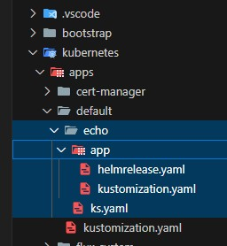

# Act 4 - Add an app

[Last time](../echo-chamber/echo-chamber.md) we learned how to modify our running cluster by
eliminating our beloved echo service.  We observed that we can easily modify the configuration
of our cluster, commit to our repository, and the changes are applied immediately.  We saw
that our configuration changes affect DNS entries, certificates, routing, and running containers.

This time instead of destroying resources, let's create something new.

# Echo's remains

To figure out what we need to do let's poke around in echo's remains, we left its config in our
repo, it's just not referenced anymore.

---

- Let's copy the echo directory into a new a `hello` directory:

---

