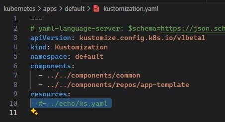

# Act 3 - Echo chamber

[Last time](../finish-up/finish-up.md) we finished setting up our home lab cluster using
[cluster-template](https://github.com/onedr0p/cluster-template) to get kubernetes installed
on [talos linux](https://www.talos.dev/) on a virtual machine.  We haven't done anything to
modify what cluster-template has provided so far.

# Recap

If you recall we have our cluster running on *somedomain.net* with public hosts of:

- *external.somedomain.net*

This is our entry into our cluster, it points to our cloudflare tunnel which in turn is
connected to our vm.

- *flux-webhook.somedomain.net*

This is so when changes happen to our github repository, github will call this endpoint to
notify our cluster that a change occurred, flux is the recipient of this call and will
initiate changing our cluster.  The DNS entry is a CNAME to *external.somedomain.net* and
then goes through the tunnel, etc.

# Echo, echo, echo

- *echo.somedomain.net*

This was created by cluster-template to demonstrate everything is working properly end-to-end.
An http request to *https://echo.somedomain.net* should respond with a json response containing
the http headers your browser sent along with headers that cloudflare (the CDN) has injected.
This shows that DNS, certificates, and routing into your cluster is functioning properly.
It's very useful.  We will always treasure this service.  Now let's get rid of it.

When I search my repo for echo I get a few hits, most are in various shell files, we'll
ignore those.  The remainder all seem to occur under `kubernetes/apps/default`, so let's start
there.

---


`kubernetes/apps/default/kustomization.yaml` contains the definition for the 'default' namespace
in our kubernetes cluster.  If you were to run:

```bash
kubectl get pods -o wide --all-namespaces
```

You should see an instance of echo running in the default namespace:

---


As such we can deduce that to get rid of echo maybe we should start there...

# Die echo die

We can see that `kubernetes/apps/default/kustomization.yaml` is just a few lines and it references
an echo resource, let's see what happens if we just comment it out:

---



```bash
git cm "so long and thanks for all the fish"
git push
```

Give it a minute and then:

```bash
kubectl get pods -o wide --all-namespaces
```

---


A single character change!  No more echo!  No more default namespace!

If you were to go check your dns entries in cloudflare for *somedomain.net* you'd find the echo
CNAME should no longer be there.

Hopefully, we've learned that modifying the running state of our cluster is fairly easy and
nothing to be scared of.  We could revert our latest commit and push and in a minute or two our
DNS entry would be added back, the default namespace would be back, and echo would be happily
echoing again.  For the time being I'll leave everything as-is.  I'll also leave the remaining
files in `kubernetes/apps/default/echo` even though they're now no longer refererenced or used.
They can serve as a handy reference for when we want to add a new service.

[Next time](../next-time/next-time.md) we'll do something new...
