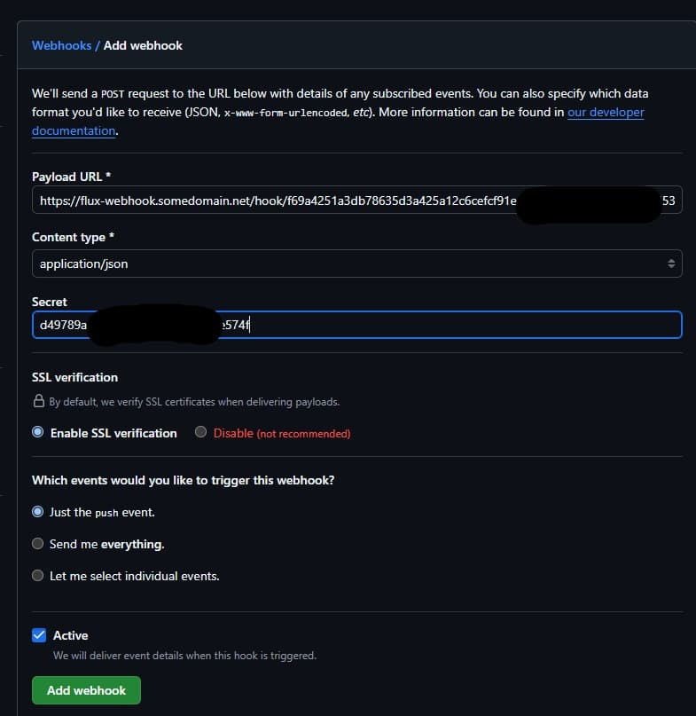
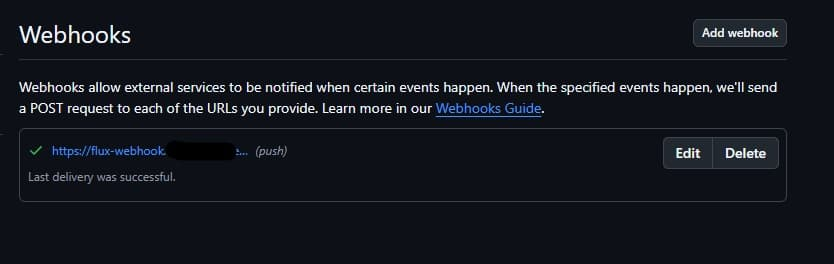

# Act 2 - Finish up

[Last time](../what-a-cluster/what-a-cluster.md) we set up our home lab kubernetes cluster on a vm with [talos linux](https://www.talos.dev/) and used [cluster-template](https://github.com/onedr0p/cluster-template) to make it all happen!  We have cloudflare and flux and echo oh my!  Where am I!?  What does it all mean?  Let's take some time for quiet reflection and review our current state.

We have:

- our domain "somedomain.net" registered in cloudflare (operating as our domain registrar)
- a github repo containing a configured cluster-template
- kubernetes on talos on a vm
- a [cloudflared](https://github.com/cloudflare/cloudflared) tunnel running from our vm to cloudflare
- "external.somedomain.net" DNS entry in cloudflare that is a CNAME to a cloudflare host that represents the cloudflare side of our tunnel connection, this was configured via cluster-template
- "echo.somedomain.net" DNS entry in cloudflare that is a CNAME to "external.somedomain.net", this was configured via cluster-template
- "flux-webhook.somedomain.net" DNS entry in cloudflare that is a CNAME to "external.somedomain.net", this was configured via cluster-template

# Setup flux webhook

[flux](https://fluxcd.io/) running in your kubernetes cluster will monitor your github repo for changes and then apply them to your cluster.  I believe it does so on a schedule, but if you want nearer realtime we'll want to make use of the above flux-webhook DNS entry above...

- Following along with cluster-template:

```bash
kubectl -n flux-system get receiver github-webhook --output=jsonpath='{.status.webhookPath}'
```

Gives me a path like so:

```
/hook/f69a4251a3db78635d3a425a12c6cefcf91e11dd696fca8e482467d91d536a7
```

- Let's add our flux webhook to our repo settings, in my case: [https://github.com/me/cluster/settings/hooks](https://github.com/me/cluster/settings/hooks)

---

Screenshot from [https://github.com/me/cluster/settings/hooks](https://github.com/me/cluster/settings/hooks):


- Slap the add webhook button

---

Screenshot from [https://github.com/me/cluster/settings/hooks/new](https://github.com/me/cluster/settings/hooks/new):

- Fill out the Payload URL which will take the form of *https://flux-webhook.somedomain.net/hook/f69a4251a3db78635d3a425a12c6cefcf91e11dd696fca8e482467d91d536a7* with the host being the DNS entry mentioned earlier and the path being the result of the above command.
- Change content type of the payload to application/json
- Paste the content of *github-push-token.txt* from your repo into the Secret field on the form
- The remainder form fields should be the defaults.
- Click add



After a period of time you should see the webhook listed and eventually a green checkmark will appear next to it.

---

Screenshot from [https://github.com/me/cluster/settings/hooks](https://github.com/me/cluster/settings/hooks):




- Finally, let's double check everything is all hooked up

```bash
task reconcile
```

# Setup Renovate

If you'd like automated pull requests for dependency updates, [Renovate](https://www.mend.io/renovate) is a handy solution. 

Follow along with the simple instructions over in [cluster-template](https://github.com/onedr0p/cluster-template?tab=readme-ov-file#-renovate).

You'll likely see a new issue in your github repository with a link to the renovate dashboard and you'll probably begin seeing pull requests to your repo with dependency updates.

# Cleanup

Finally, let's cleanup after cluster-template by running a tidy:

- Get rid of the cluster-template things we don't need anymore.
```bash
task template:tidy
```

# SOPS & vs code

I had an issue with the vscode extension working with sops installed via mise, so:

```bash
curl -LO https://github.com/getsops/sops/releases/download/v3.9.4/sops-v3.9.4.linux.amd64
sudo mv sops-v3.9.4.linux.amd64 /usr/local/bin/sops
sudo chmod +x /usr/local/bin/sops
```

Then in vscode do a File / Settings / Extensions / Sops and change the Bin Path to `/usr/local/bin/sops`

# Replace SECRET_DOMAIN

I'm choosing to replace SECRET_DOMAIN, in cluster-template this is your main domain *somedomain.net* and is stored encrypted in your repo and as a cluster secret.
Given our repo is private and I plan to add more domains in the future I'm going to yolo a find and replace on *${SECRET_DOMAIN}* with *somedomain.net*, for me, this
does 15 replacements in 9 files.  Next up, I'm going to lob a find and replace of *${SECRET_DOMAIN/./-}* with *somedomain-net*, this does 4 replacements in 3 files.
Finally, SECRET_DOMAIN still exists encrypted in the */kubernetes/components/common/cluster-secrets.sops.yaml* file (in decrypted form), I also remove it from there
with the vscode SOPS extension

- Push our current state to our repo
```bash
git cm "cleanup!"
git push"
```
# Fin

The cluster is all ours and we can start using it to do what we'd like!

[Next time](../next-time/next-time.md) we'll do something new...
